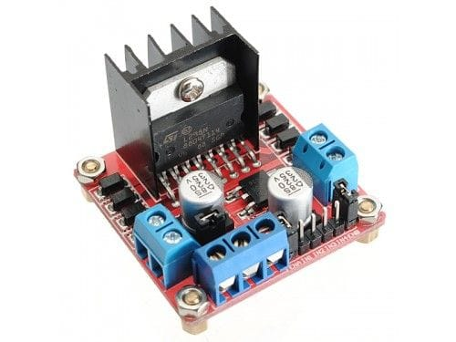
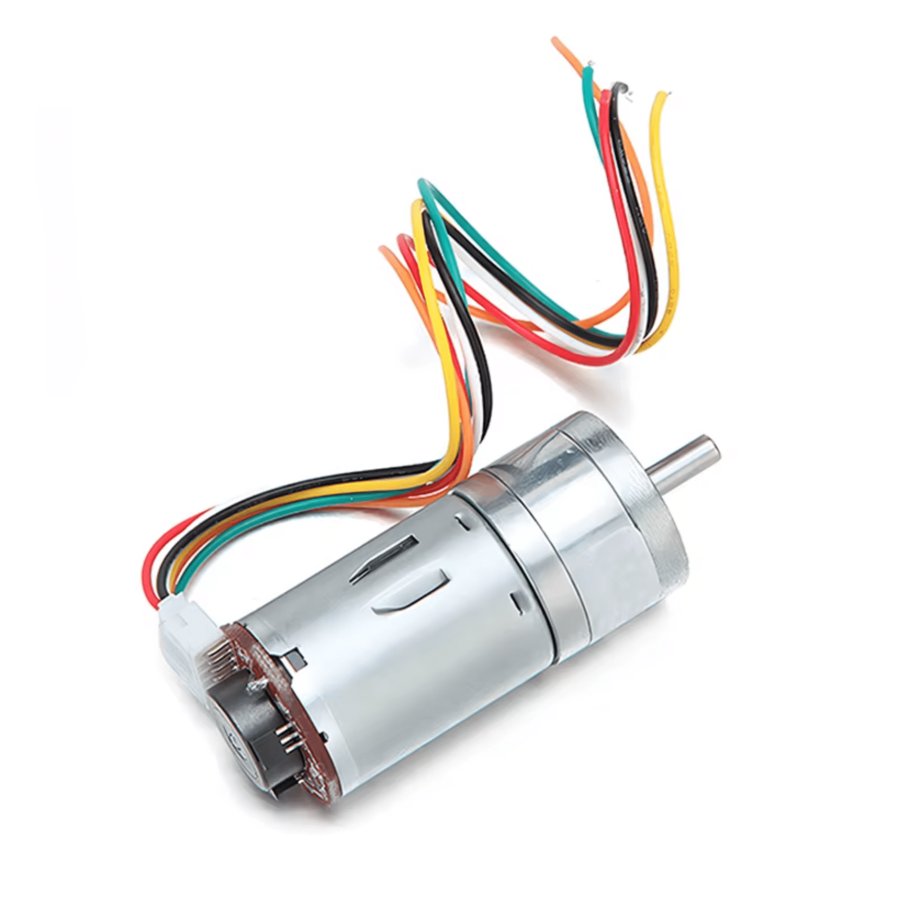
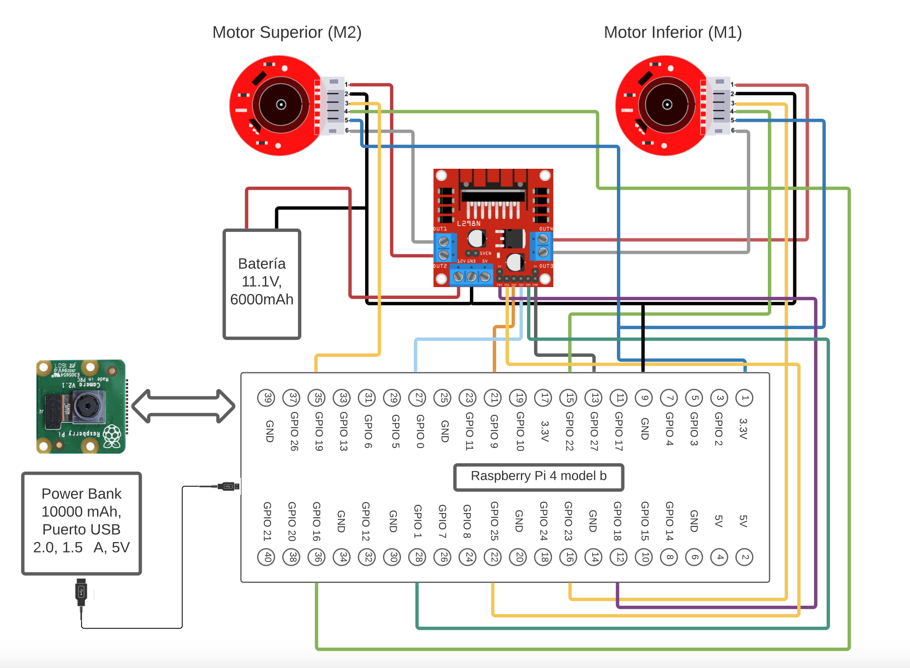

# Python-DC-Motor-Control-Library-for-Raspberry-Pi

Welcome to the DC Motor Control Library designed for the Raspberry Pi 4 utilizing Python. This library provides robust functionality for controlling DC motor position (i.e. angle) using Pulse Width Modulation (PWM), and is tailored for use with drivers such as the L298N motor driver. To successfully use this library, you'll need to understand the basics about DC brushed DC motors, motor encoders (incremental ones in this case), basics about using a raspberry pi, control systems, and a basic notion of embedded systems and micro-controller programming.

# Introductory concepts

PID Control: The library incorporates PID (Proportional-Integral-Derivative) control techniques to optimize motor performance. PID controllers use feedback from encoders to adjust motor commands dynamically, ensuring stable and accurate motor control, particularly under varying load conditions.

Pulse Width Modulation (PWM): PWM is an effective way to control motor speed and direction by varying the width of the pulses, enabling precise adjustments in motor operations.

Interrupts: Handling real-time events accurately is crucial in motor control. This library uses interrupts to promptly manage tasks like speed monitoring and direction changes, enhancing overall system responsiveness.

DC Motor with Encoder: Encoders provide necessary feedback for accurate control over motor position and speed, which is indispensable for closed-loop control systems.

For more information about controlling DC brushed motors with encoders, refer to the following source: https://curiores.com/positioncontrol

# Features

Port Mapping and Instantiation: The library provides a class where you can configure port mappings for setting up PWM (pulse width modulation) output pins and input pins for motor encoder in the Raspberry Pi 4.

Control Methods: Utilize intuitive control methods such as .move(degrees) to specify precise motor movements, enhancing ease of use in motor management tasks.

PID Parameters Customization: The library offers flexibility in defining PID control parameters, enabling you to fine-tune the motor control system tailored to your project's requirements.

This library assumes the use of incremental motor encoders. For more information, refer to the following source: https://www.dynapar.com/technology/encoder_basics/motor_encoders/

# Example Hardware
You can you any motor driver and DC motors you desire, provided you understand how to use them. For our example the following hardware is used:

Motor driver : L298N https://www.cimech3d.cl/producto/driver-l298n-doble-accionamiento-para-arduino/

  

Motor: DC brushed motor with incremental encoder:  https://www.amazon.com/uxcell-Motor-Encoder-463RPM-Ratio/dp/B0792T5445

  

# Getting started

# Circuit schematic
Provided bellow is an example implementation of the hardware wiring between the Raspberry Pi 4, two DC brushed motors with their encoders, and the L298N motor driver. This library is not limited to the hardware used in the example implementation.

  

